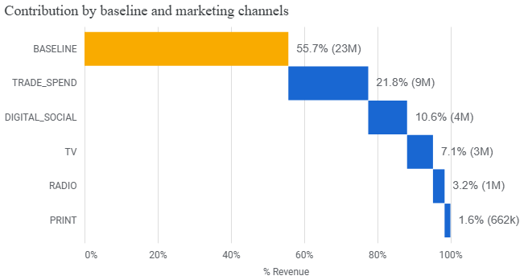
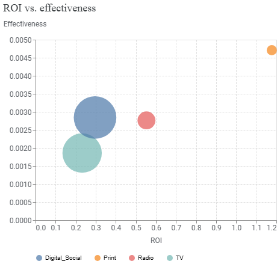
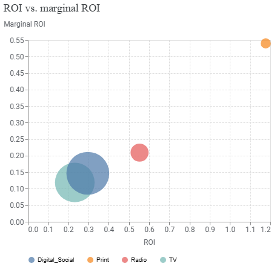
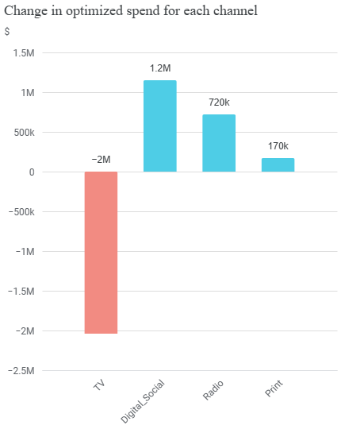
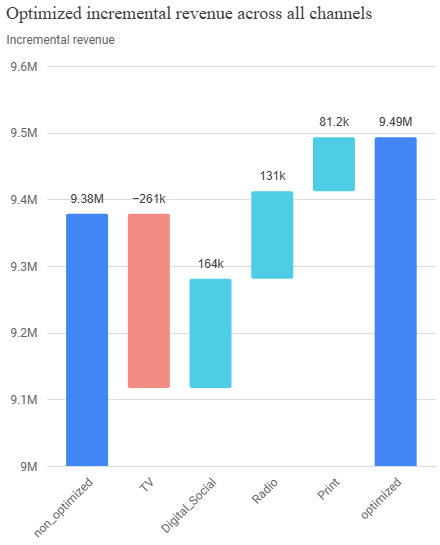

# India E-commerce Brand B MMM Case Study

A portfolio-ready Marketing Mix Modeling (MMM) case study built with **Google Meridian** to evaluate media contribution, ROI, response curves, and budget reallocation opportunities for **Brand B (India e-commerce)**.

---

## Executive Summary

This project translates MMM outputs into practical budget decisions for business stakeholders. Over the period **Jul 2, 2022 – Jun 28, 2025**, the Meridian model delivered strong fit metrics (**R²: 0.99, MAPE: 2%, wMAPE: 2%**) and a clear decomposition of revenue drivers. The analysis shows that Brand B’s performance is driven by both baseline demand and non-media factors (notably Trade Spend), while media channels vary significantly in both scale and efficiency.

A constrained optimization scenario (fixed total budget, ±30% channel-level reallocation limits) indicates that improved allocation can generate an estimated **~115K incremental revenue lift** without increasing spend.

---

## Business Question

How should Brand B reallocate its existing media budget to improve incremental revenue while balancing:
- channel contribution at scale,
- channel-level ROI and marginal ROI,
- practical constraints on budget movement?

---

## Why MMM / Why Meridian

### Why MMM
MMM is appropriate for strategic budget planning because it helps quantify:
- baseline vs. incremental revenue,
- channel-level contribution,
- expected returns under alternative spend allocations.

### Why Google Meridian
Google Meridian provides a Bayesian MMM framework that supports:
- probabilistic channel impact estimation,
- response-curve-based saturation analysis,
- scenario-based budget optimization under real-world constraints.

---

## Dataset Scope

- **Brand scope:** Brand B only (not pooled across multiple brands)
- **Geography:** India
- **Analysis window:** Jul 2, 2022 – Jun 28, 2025
- **Primary components analyzed:**
  - media spend and contribution by channel,
  - Trade_Spend effect,
  - non-media controls (price index, festival index, rainfall index),
  - ROI and marginal ROI,
  - optimization outputs under constrained reallocation.

---

## Methodology

At a high level, this case study followed five phases:
1. **Business framing & variable selection** (Brand B-specific decision scope)
2. **MMM estimation in Google Meridian** (Bayesian contribution/ROI modeling)
3. **Model refinement** (including multicollinearity handling)
4. **Output interpretation** (contribution, ROI, response curves, marginal ROI)
5. **Constrained optimization** (fixed budget reallocation simulation)

See detailed write-up: [`docs/methodology.md`](docs/methodology.md).

---

## Model Refinement and Multicollinearity Handling

Multicollinearity was a key concern, especially across digital channels. The project used:
- correlation checks,
- VIF diagnostics,
- channel grouping decisions where needed (e.g., Facebook + Instagram grouped into Meta; broader Digital Social grouping depending on final model specification).

This was done to improve interpretability and reduce coefficient instability while preserving business-relevant signal.

See full rationale: [`docs/modeling-decisions.md`](docs/modeling-decisions.md).

---

## Key Results

### Model fit
- **R-squared:** 0.99
- **MAPE:** 2%
- **wMAPE:** 2%

> Note: Fit quality was treated as necessary but not sufficient; interpretation also relied on diagnostics, business logic, and response behavior.

### Revenue contribution breakdown
- **Baseline:** 55.7% (~23M)
- **Trade_Spend:** 21.8% (~9M)
- **Digital_Social:** 10.6% (~4M)
- **TV:** 7.1% (~3M)
- **Radio:** 3.2% (~1M)
- **Print:** 1.6% (~662K)

### ROI insights
- **Print:** ~1.18 (highest efficiency)
- **Radio:** ~0.55
- **Digital_Social:** ~0.30
- **TV:** ~0.23

Response curves were used to evaluate channel saturation and incremental headroom, not ROI in isolation.

---

## Budget Optimization Insights

Optimization setup:
- fixed total budget (~31M before and after),
- channel reallocation constraints of **-30% to +30%** vs. historical spends.

Results:
- **Non-optimized incremental revenue:** ~9.38M
- **Optimized incremental revenue:** ~9.49M
- **Estimated lift:** **~+115K** incremental revenue

Recommended allocation shifts:
- **Digital_Social:** 49% → 53%
- **TV:** 42% → 35%
- **Radio:** 8% → 10%
- **Print:** 2% → 2%

See details: [`docs/optimization-insights.md`](docs/optimization-insights.md).

---

## Business Recommendations

1. **Reallocate for marginal gains, not just average ROI.**
   - Increase channels with stronger incremental headroom under constraints.
2. **Protect scale while improving efficiency.**
   - Treat high-scale channels (e.g., TV, Digital_Social) differently from high-efficiency but low-scale channels (e.g., Print).
3. **Institutionalize MMM as a planning cadence.**
   - Refresh modeling periodically and use response-curve movement as a trigger for budget updates.

---

## Limitations

- Results are based on observed historical relationships and available controls.
- High in-sample fit does not eliminate uncertainty in future conditions.
- Optimization output is scenario-dependent and constrained by preset movement limits.
- Channel aggregation decisions improve stability but may reduce sub-channel granularity.

See full discussion: [`docs/limitations.md`](docs/limitations.md).

---

## Project Impact (for Recruiters)

- Built a business-facing Bayesian MMM case study translating model outputs into boardroom-ready budget actions.
- Identified a constrained reallocation path with **~115K incremental upside** at constant total spend.
- Demonstrated rigorous modeling judgment by balancing fit metrics with multicollinearity handling, control-variable context, and practical recommendation logic.

---

## Resume Bullets (2–3 options)

- Developed a Google Meridian-based MMM for an India e-commerce brand (Jul 2022–Jun 2025), quantifying channel contribution, ROI, and response curves to support investment decisions.
- Designed a constrained budget optimization scenario (±30% reallocation bounds, fixed ~31M spend) that estimated ~115K incremental revenue lift.
- Improved model interpretability and decision quality by addressing digital-channel multicollinearity with correlation/VIF diagnostics and channel grouping.

---

## LinkedIn Featured Project Description

Built an end-to-end Marketing Mix Modeling case study for an India e-commerce brand using Google Meridian. I translated Bayesian MMM outputs into clear business recommendations by combining channel contribution analysis, ROI and marginal ROI interpretation, response-curve saturation insights, and constrained budget optimization. The final recommendation showed how Brand B could improve incremental revenue (~115K lift) through smarter reallocation at constant total budget.

---

## Tech Stack

- **Modeling:** Google Meridian (Bayesian MMM)
- **Analysis workflow:** Notebook-based analysis
- **Reporting artifacts:** Markdown + PDF portfolio reports
- **Version control:** Git / GitHub

---

## Repository Structure

```text
/
  README.md
  /docs
    project-overview.md
    methodology.md
    modeling-decisions.md
    optimization-insights.md
    limitations.md
  /notebooks
    meridian_prac.ipynb
  /reports
    brandB_mmm_case_study.pdf
    brandB_budget_optimization_summary.pdf
  /assets
    /images
      model-fit.png
      contribution-breakdown.png
      roi-chart.png
      response-curves.png
      optimization-allocation.png
      README.md
  /src
    README.md
  /data
    README.md
```

---

## How to Reproduce / View Outputs

### Quick view (portfolio mode)
1. Start with this README.
2. Read:
   - [`docs/project-overview.md`](docs/project-overview.md)
   - [`docs/methodology.md`](docs/methodology.md)
   - [`docs/modeling-decisions.md`](docs/modeling-decisions.md)
   - [`docs/optimization-insights.md`](docs/optimization-insights.md)
   - [`docs/limitations.md`](docs/limitations.md)
3. Open PDF artifacts in `/reports`:
   - `brandB_mmm_case_study.pdf`
   - `brandB_budget_optimization_summary.pdf`

### Notebook view (analysis mode)
- Open [`notebooks/meridian_prac.ipynb`](notebooks/meridian_prac.ipynb) to review notebook-driven analysis and outputs.

### Artifact conversion note
Some analysis outputs were originally generated in notebook/HTML-like formats and then converted into PDF artifacts for easier recruiter and stakeholder sharing, versioning, and portfolio presentation.

---

## Key Visuals








